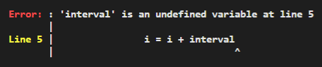

* A [Function](../function) is a collection of statements or a block of code which can be run anytime and ***anywhere*** we like.
* Of course, ***anywhere*** implicitly assumes that the function is declared in the same scope or an outer scope, just like variables.
* Ari's functions are [first class citizens](https://en.wikipedia.org/wiki/First-class_function), meaning that they can be stored in variables and passed around as arguments to other functions.

* [Function](../function) **names** can only contain **numbers**, **alphabets**, and the **underscore** `_`. Also, names **cannot begin** with a number; 

***
## ** Declaration **

* The ```fn``` keyword indicates the declaration of a new function.
* Declaration syntax must consist of:
    * [x] ```fn``` keyword
    * [x] functions's name
    * [x] a pair of curved brackets which represent's the function's arguments/parameters
    * [x] a pair of curly brackets which represent's the functions's [scope](../variable#block-scoping-and-shadowing)
    ```
    fn function_no_arguments() {
        println "A";
    }

    fn function_1_argument(a) {
        println a / 10;
    }

    fn function_2_arguments(a, b) {
        println a + b;
    }
    ```

* Call/invoke the function by specifying the arguments inside a pair of curved brackets and placing them to the right of the function.
    
    ```
    function_no_arguments();
    function_1_argument(20);
    function_2_arguments("Good ", "morning");
    ```

* We can redeclare the same function as many times as we like.

    ```
    fn do_something() {
        println "A";
    }

    fn do_something() {
        println "B";
    }

    fn do_something() {
        println "C";
    }

    do_something(); // Prints C
    ```

***
### **return**

* A ```return``` keyword **quits** the function and returns to where the function was last called.
* The program below does not print anything because ```return``` stops the loop.

    ```hl_lines="2"
    fn hello() {
        return;
        println "hello";
    }
    hello();
    ```

* A [Function](../function) can return any kind of value:

    ```hl_lines="2"
    fn hello() {
        return "Hello";
    }
    println hello();
    ```

* For multiple return values, return an array instead:

    ```hl_lines="4"
    fn hello() {
        let a = "Hello";
        let b = " there";
        return [a, b];
    }
    let array_value = hello();
    println array_value[0] + array_value[1];
    ```

!!! info "Info"
    * If the function returns nothing, ```return``` is not required.

        ```hl_lines="3"
        fn func() {
            // do something
            return;
        }
        ```

        should become:

        ```
        fn func() {
            // do something
        }
        ```

***
## **First class functions**

* Functions can be stored inside variables:

    ```
    fn add_two_numbers(a, b) {
        println a + b;
    }
    let my_variable = add_two_numbers;
    my_variable(10, 30); // Prints 40
    ```

* Functions can also return other functions:

    ```
    fn outer_function() {
        fn inner_function(a) {
            println a * 10;
        }
        return inner_function;
    }
    let my_function = outer_function();
    my_function(7); // Prints 70
    ```

***
## **Closures**

* First class functions keep a **copy** of their outer [scope](../variable#block-scoping-and-shadowing).
* This copy is cloned together with the function if it is assigned to other variables.

!!! tip "The program below is a good demonstration of closures:"
    ```hl_lines="2"
    fn makeCounter(interval) {
        let interval = interval;
        let i = 0;
        fn count() {
            i = i + interval;
            println i;
        }
        return count;
    }

    let counter1 = makeCounter(1);
    counter1(); // "1"
    counter1(); // "2"
    counter1(); // "3"

    let counter5 = makeCounter(5);
    counter5(); // "5"
    counter5(); // "10"
    counter5(); // "15"

    let counter5_copy = counter5;
    counter5_copy(); // "20"
    counter5_copy(); // "25"
    counter5_copy(); // "30"

    counter5(); // "20"
    ```

    * **Line 1** declares a function ```makeCounter(interval)``` which returns a counter. This counter has access to the outer variable, `i`, because of the closure property.
    
    * ```makeCounter(interval)``` offers the option to set the interval of the counter using the `interval` argument.
    
    * **Line 2** explicitly declares the ```interval``` argument in the closure so that the counter has access to it.
    
    * **Line 11** creates ```counter1``` which has an interval of 1.

    * **Lines 12 to 14** prints 1, 2 and 3 respectively because the counter has an interval of 1.

    * **Line 16** creates ```counter5``` which has an interval of 5.

    * **Lines 17 to 19** prints 5, 10 and 15 respectively because the counter has an interval of 5.

    * **Line 21** declares ```counter5_copy``` which is a copy of ```counter5```. Take note that the `i` of  ```counter5``` is 15 at this point. The closure property causes ```counter5_copy``` to also inherit an `i` of 15.

    * **Lines 22 to 24** prints 20, 25 and 30 respectively because ```counter5_copy``` starts from an `i` of 15.

    * **Line 26** prints 20 because the `i` of  ```counter5``` was 15 before this line was executed.

***
!!! warning "Beware of undeclared closure variables:"
   
    * When returning a function, ***A***, as a value from another function, ***B***, we **cannot** expect ***A*** to capture the arguments of ***B*** automatically.
    
    * Instead, we need to **explicitly declare** the argument in the closure so that ***A*** can inherit it. Refer to **Line 2** of the previous example.

    * The program below is similar to the previous example but **Line 2** is commented out.

    ```hl_lines="2"
    fn makeCounter(interval) {
        // let interval = interval;
        let i = 0;
        fn count() {
            i = i + interval;
            println i;
        }
        return count;
    }

    let counter5 = makeCounter(5);
    counter5(); // Error
    ```

    * **Line 12** results in an error shown below because ```count()``` cannot capture the ```interval``` argument:

    {: loading=lazy }

