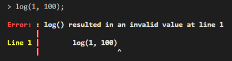

* A [Number](../number) is stored as a 32-bit float.
* Generally, **no distinction** is made between integers and floating-point values, except in some cases where integers are strictly required.

***
## ** Arithmetic **

| Operator   | Description |
| :--------: | :---------: |
| `+`        | Addition    |
| `-`        | Subtraction |
| `*`        | Multiply    |
| `/`        | Divide      |

!!! info "Info"
    [Number](../number) can be added to [String](../string) to produce a new [String](../string):
    
    `1 + " Malaysia"` is equal to `"1 Malaysia"`

!!! warning "Warning"
    Division by zero will result in an error.

!!! example "Example 1"

    === "REPL.IT"

        <iframe height="400em" width="100%" src="https://repl.it/@FongChien/Numbers-1?lite=true" scrolling="no" frameborder="no" allowtransparency="true" allowfullscreen="true" sandbox="allow-forms allow-pointer-lock allow-popups allow-same-origin allow-scripts allow-modals"></iframe>

    === "Code only"

        ```
        println 1 + 3 / 5;                          // 1.6
        println  4 - 3 * (4 - 2 * (6 - 3)) / 3;     // 6
        println 0.99999 / 0.99999;                  // 1
        println 1 / 0;                              // Division by zero error
        ```

***
## ** Logical comparisons **

| Operator   | Description         |
| :--------: | :---------:         |
| `==`       | Equal to            |
| `!=`       | Not equal to        |
| `>`        | Greater             |
| `>=`       | Greater or equal to |
| `<`        | Less than           |
| `<=`       | Less or equal to    |

!!! info "Info"
    Logical comparisons return a [Boolean](../boolean).

!!! example "Example 2"

    === "REPL.IT"

        <iframe height="400em" width="100%" src="https://repl.it/@FongChien/Numbers-2?lite=true" scrolling="no" frameborder="no" allowtransparency="true" allowfullscreen="true" sandbox="allow-forms allow-pointer-lock allow-popups allow-same-origin allow-scripts allow-modals"></iframe>

    === "Code only"

        ```
        println  1 == 1.0;      // true
        println 2.999999  < 3;  // true
        println 2.9999999 < 3;  // false
        println 2.9999999 <= 3; // true
        println 2.9999999 > 3;  // false
        ```

!!! question "Question"
    * From the example above, why is `2.999999  < 3` equal to `true`
    
        **but**

        `2.9999999 < 3` equal to `false`?
    
    * What does this demonstrate about Ari's floating-point numbers?

??? tip "Answer"
    Ari's [Number](../number) is stored as a 32-bit float, so its precision is limited.

***
## ** Built-in functions **

### to_string

???+ abstract ""
    **to_string([Number](../number))** ➟ **[String](../string)**

    !!! info ""
        * Converts [Number](../number) to a [String](../string) value

***
### power

???+ abstract ""
    **power(base: [Number](../number), power: [Number](../number))** ➟ **[Number](../number)**

    !!! info ""
        * Returns [base ^ power](https://en.wikipedia.org/wiki/Exponentiation)

***
### log

???+ abstract ""
    **log(base: [Number](../number), value: [Number](../number))** ➟ **[Number](../number)**

    !!! info ""
        * Returns the [logarithm](https://en.wikipedia.org/wiki/Logarithm) of [value](../number) with the given [base](../number)

    !!! warning "Warning"
        * The program halts with this error if the log value is invalid (NaN or Inf):

        {: loading=lazy }

***
### modulo

???+ abstract ""
    **modulo(value: [Number](../number), modulee: [Number](../number))** ➟ **[Number](../number)**

    !!! info ""
        * Returns the result of [value](../number) [modulo(%)](https://en.wikipedia.org/wiki/Modulo_operation) [modulee](../number)

    !!! warning "Warning"
        * Both [value](../number) and [modulee](../number) must be integers. Also, the [modulee](../number) cannot be zero.

*** 
### absolute

???+ abstract ""
    **absolute([Number](../number))** ➟ **[Number](../number)**

    !!! info ""
        * Returns the absolute value of the input

***
### floor

???+ abstract ""
    **floor([Number](../number))** ➟ **[Number](../number)**

    !!! info ""
        * Returns the greatest integer less than or equal to the input

***
### ceiling

???+ abstract ""
    **ceiling([Number](../number))** ➟ **[Number](../number)**

    !!! info ""
        * Returns the least integer greater than or equal to the input

***
### min

???+ abstract ""
    **min([Number](../number), [Number](../number))** ➟ **[Number](../number)**

    !!! info ""
        * Returns the minimum of the two inputs

***
### max

???+ abstract ""
    **max([Number](../number), [Number](../number))** ➟ **[Number](../number)**

    !!! info ""
        * Returns the maximum of the two inputs