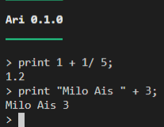
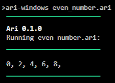

## **Make Ari come alive**

* Once Ari is [downloaded](../../setup/download), either:
    * double-click the file
    
        **or**
    
    * open a command line in the same folder and enter `ari-windows` or `./ari-linux`

* Ari's interface should look like this
    ```
    ‾‾‾‾‾‾‾‾‾
    Ari 0.1.0
    _________

    > 
    ```

### **Interpreter mode**

* The above interface is called the interpreter mode or more commonly known as [REPL](https://en.wikipedia.org/wiki/Read%E2%80%93eval%E2%80%93print_loop).
* Experiment with Ari by typing in Ari-compatible syntax:

    {: loading=lazy }

### **Run a program**

* For most practical purposes, it is better to write an Ari program in a separate file.
* For example, if the file's name is called `even_numbers.ari`, open the command line and enter `ari-windows even_numbers.ari` or `./ari-linux even_numbers.ari`

!!! example ""

    * Below is a sample code for `even_numbers.ari` and the result:

        ```
        for(let i = 0; i < 10; i = i + 2) {
            print i + ", ";
        }
        ```

    {: loading=lazy }

***
## **Values**

* Values are Ari's bread and butter:
    ```
    1;               // Number
    "Good mourning"; // String
    true;            // Boolean
    null;            // Null
    [1, 2, 3];       // Array of Numbers
    ["abc", "def"]; // Array of Strings
    ```
* [Logical comparisons](../number#logical-comparisons) are also essential.
* Check out the other sections for more info.

***
## **Semicolon**

* Never forget to add semicolons behind each statement. I know it is annoying, but consider it a mental discipline, like house chores.
    ```hl_lines="2"
    1 + 2;
    50 + 70  // Missing semicolon!
    19 + 21;
    ```

***
## **Whitespace**

* Ari doesn't care about whitespace. How much spacing to use is up to you:
    ```
       3; 2;    2; 3;
       4;   1;1;   4;
        5;        5;
          6;    6;
            7;7;
         
    "I love whitespace";
    ```

***
## **Comments**

* Everyone loves to gossip, so comment to your heart's content by adding double slashes, `//`:
    ```
    "Shoplifters will be prostituted";
    // Note to self: Change this misspelling in one year's time when I review this code again.
    // Just kidding.
    ```

***
## **Variables**

* The [`let`](../variable#declaration) keyword indicates the declaration of a new variable.
* [Variable](../variable) **names** can only contain **numbers**, **alphabets**, and the **underscore** `_`. Also, names **cannot begin** with a number.
    ```hl_lines="4"
    let a = 1;
    a = 2;
    a = 3 + a; // 5
    let 3musketeers = 3; // Error because variable name starts with a number
    ```

!!! warning "Reserved keywords"
    * `class`, `super`, and `this` are reserved for a future version of Ari which includes classes, so they are **forbidden**.

* [**Block scoping and shadowing**](../variable#block-scoping-and-shadowing) are extremely important concepts that are relevant in other languages.

***
## **Displaying output**

* [`print`](../builtin_functions#print) displays something in the command line:
    ```hl_lines="2"
    let a = 10;
    print "Item no. ";
    print a;
    // Output: Item no. 10
    ```

*  [`println`](../builtin_functions#println) adds a newline at the end of the output:
    ```hl_lines="2"
    let a = 10;
    println "Item no. ";
    println a;
    // Output: Item no.
    //         10
    ```

***
## **If-Else**

* The typical [`if`](../control_flow#if) - [`else`](../control_flow#else) trope:
    ```
    let a = "apple";
    if (a == "banana") {
        println "banana";
    }
    else {
        println a; // This gets printed
    }
    ```

***
## **Loops**

* [While loops](../control_flow#while) repeat as long the condition is [true](../boolean):
    ```
    let a = 3;
    while(a > 0) {
        println a;
        a = a - 1;
    }
    // 3
    // 2
    // 1
    ```

* [For loops](../control_flow#for) simplify counter-like loops:
    ```
    for(let a = 3; a > 0; a = a- 1) {
        println a;
    }
    // 3
    // 2
    // 1
    ```

* There are also [keywords](../control_flow#loop-keywords) like [`continue`](../control_flow#continue) and [`break`](../control_flow#break)

## **Exiting the program prematurely**

* [`bai`](../builtin_functions#bai) quits the program and prints a given value:
    ```
    for(let a = 3; a > 0; a = a- 1) {
        println a;
        if(a == 2) {
            bai "i'm sick of loops.";
        }
    }
    // 3
    // 2
    // I'm sick of loops
    // Program ends
    ```

***
## **Arrays**

* [Arrays](../array) must contain the same type of elements.
* Indexes start from 0.
    ```hl_lines="5"
    let a = [1, 2, 3];  // Array of Numbers
    let b = ["x", "y"]; // Array of Strings
    a[1] = 5;
    println a; // [1, 5, 3]
    a[2] = b[1]; // Error because different types
    ```

* Arithmetic for arrays of [Numbers](../number) are straightforward:
    ```
    let a = [1, 2, 3];
    let b = [10, 20, 30];
    println a + b; // [11, 22, 33]
    println a * b; // [10, 40, 90]
    ```

* [map](../array#map), [filter](../array#filter) and [reduce](../array#reduce) are especially useful for quick array transformations.

***
## **Functions**

* [Functions](../function) enable code reusability:
    ```
    fn is_greater(input) {
        return input > 5;
    }
    println is_greater(1); // false
    println is_greater(6); // true
    ```

* Functions are **first class citizens**. [**What does this mean?**](../function#first-class-functions)
* [**Closure**](../function#closures) is another important concept to grasp and is relevant to [other languages](https://developer.mozilla.org/en-US/docs/Web/JavaScript/Closures).

***
## **Built-in Functions**

* Built-in functions are useful for executing common operations without reinventing the wheel.
* There are built-in functions for [Number](../number#built-in-functions), [String](../string#built-in-functions) and [Array](../array#built-in-functions).

* Other functions include:
    * [Generating random numbers](../builtin_functions#random-generation)
    * [Reading and writing to files](../builtin_functions#file-operations)
    * [Web stuff](../builtin_functions#web-stuff)

***
## **More Examples**

* Go [here](../examples)

***