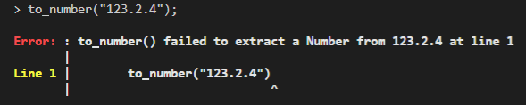

* A [String](../string) is a sequence of characters or symbols with a dynamic length.

***
## ** Arithmetic **

| Operator   | Description   |
| :--------: | :---------:   |
| `+`        | Concatenation |

!!! info "Info"
    * Concatenation is the merging of two or more [Strings](../string) to produce a larger combined [String](../string).

    * [Number](../number) can be added to [String](../string) to produce a new [String](../string):
    
        `1 + " Malaysia"` is equal to `"1 Malaysia"`

***
## ** Logical comparisons **

| Operator   | Description         |
| :--------: | :---------:         |
| `==`       | Equal to            |
| `!=`       | Not equal to        |

!!! info "Info"
    Logical comparisons return a [Boolean](../boolean).

!!! warning "Warning"
    * [String](../string) cannot be logically compared with [Number](../number). We will need to convert the [String](../string) to [Number](../number) or vice versa.

    * Ordered comparisons such as `>` or `<` do not work for [String](../string). For length comparisons, use the [`length()`](../string) function to get the [String's](../string) length which can then be compared numerically.

!!! example "Example"

    === "REPL.IT"
    
        <iframe height="400em" width="100%" src="https://repl.it/@FongChien/String-1?lite=true" scrolling="no" frameborder="no" allowtransparency="true" allowfullscreen="true" sandbox="allow-forms allow-pointer-lock allow-popups allow-same-origin allow-scripts allow-modals"></iframe>

    === "Code only"

        ```
        println "abc" == "def"; // false
        println "abc" == "abc"; // true
        println "abc" + "def";  // "abcdef"
        println "abc" + 123;    // "abc123"
        println  "abc" - "def"; // Error because Strings cannot be subtracted
        ```

***
## ** Built-in functions **

### length

???+ abstract ""
    **length([String](../string))** ➟ **[Number](../number)**

    !!! info ""
        * Returns the [String](../string)'s length.

***
### to_number

???+ abstract ""
    **to_number([String](../string))** ➟ **[Number](../number)**

    !!! info ""
        * Converts [String](../string) to a [Number](../number) value and returns it

    !!! example ""

        === "Example"
            !!! tip ""
                ```
                println to_number("3.142"); // 3.142
                ```

        === "Warning"
            !!! warning "Warning"
                * [String](../string) must be a valid integer or floating point number. Otherwise, the program halts with this error:

                {: loading=lazy }

***
### split

???+ abstract ""
    **split(source: [String](../string), delimiter: [String](../string))** ➟ **Array[[String](../string)]**

    !!! info ""
        * Splits the [source](../string) into a [String](../string) [Array](../array) according to a [delimiter](../string) and returns the [Array](../array)

    !!! tip "Example"
        ```
        println split("hey, there, whatchu, doing", ",");
        // ["hey", "there", "whatchu", "doing"]
        ```

***
### insert

???+ abstract ""
    **insert(source: [String](../string), index: [Number](../number), new_value: [String](../string))** ➟ **Array[[String](../string)]**

    !!! info ""
        * Inserts [new_value](../string) into the [source](../string) at the [index](../number) and returns the result

    !!! example ""
        === "Example"

            !!! tip ""
                ```
                println insert("arna", 2, "ia"); // "ariana"
                ```

        === "Warning"
            !!! warning ""
                * [index](../number) must be a **positive integer** and **within the length** of the array.
                
                * Otherwise, the program halts with either of these errors:
                
                {: loading=lazy }
                
                {: loading=lazy }

***
### remove

???+ abstract ""
    **remove(source: [String](../string), index: [Number](../number))** ➟ **[String](../string)**

    !!! info ""
        * Removes a character specified by the [index](../number) from the [source](../string) and returns the result

    !!! example ""
        === "Example"

            !!! tip ""
                ```
                println remove("ariana", 2); // "arana"
                ```

        === "Warning"

            !!! warning ""
                * [index](../number) must be a **positive integer** and **within the length** of the array.
                
                * Otherwise, the program halts with either of these errors:

                {: loading=lazy }

                {: loading=lazy }


***
### to_lowercase

???+ abstract ""
    **to_lowercase([String](../string))** ➟ **[String](../string)**

    !!! info ""
        * Returns a lowercased version of the input [String](../string) 

***
### to_uppercase

???+ abstract ""
    **to_uppercase([String](../string))** ➟ **[String](../string)**

    !!! info ""
        * Returns a uppercased version of the input [String](../string) 