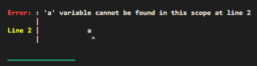
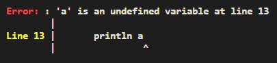

* A [Variable](../variable) is a reference to a block of memory containing any one of the literals: either [Number](../number), [String](../string), [Boolean](../boolean), [Null](../null), [Function](../function), or [Array](../array).

* The block of memory is dynamically allocated and deallocated automatically using both the stack and heap.

* [Variable](../variable) **names** can only contain **numbers**, **alphabets**, and the **underscore** `_`. Also, names **cannot begin** with a number; 

***
## **Declaration**

* The ```let``` keyword indicates the declaration of a new variable.
* Declaration syntax must consist of:
    * [x] ```let``` keyword
    * [x] variable's name
    * [x] equal symbol, `=`
    * [x] initial value of the variable
    
    ```
    let a = 1;
    println a; // 1
    ```

* We can redeclare the same variable as many times as we like.

    ```hl_lines="1 3 5"
    let a = 1;
    println a; // 1
    let a = 2;
    println a; // 2
    let a = 3;
    println a; // 3
    ```

## **Assignment**

* ```let``` is only used to declare a **new** [Variable](../variable). Exclude it to **mutate or change** the value of an existing [Variable](../variable):
    
    ```hl_lines="2"
    let a = 1;
    a = 2; // Assign value 2 to a
    println a; // 2
    ```

!!! warning "Always declare variables first before assigning values"
    ```hl_lines="1 2"
    let b = 1;
    a = 2; // Error!
    println a + b;
    ```

    * Next, we try changing `a` to `b` in **Line 1**.
    * **Line 2** results in an error because `a` is an undeclared variable. The program halts with the error below:

    {: loading=lazy }

***
## **Block scoping and shadowing**

* The space inside a pair of curly braces, `{...}`, has a new "inner scope", which is something like a fresh new environment.
* Scopes can be created and nested as many times as we like:

    ```hl_lines="1 3 5 7"
    // Outer scope
    {
        // 1st inner scope
        {
            // 2nd inner scope
            {
                // 3rd inner scope
            }
        }
    }
    ```

***
* Variables declared inside an inner scope can access variables from outer scopes.

    ```hl_lines="7"
    let a = 2;
    {
        {
            let b = 5;
            {
                {
                    println a + b; // 7
                }
            }
        }
    }
    ```

***

* Variables declared inside an inner scope ***shadows*** the outer scopes' variables of the same name.
* ***Shadowing*** is **temporarily** using a new representation/value of a variable.
Once the inner scope ends, the previous/original/old value of the outer scope is restored to the variable.
* Again, this **only** occurs when the inner and outer variables share the **same name**.

!!! tip "To understand this better, let us deconstruct the program below line by line"
    ```hl_lines="9 11 13"
    // Global scope
    let a = 1;
    {
        // Outer scope
        let a = 2;
        {
            // Inner scope
            let a = 3;
            println a; // 3
        }
        println a; // 2
    }
    println a; // 1
    ```

    * **Line 1** declares a variable `a` with a value of 1 in the **global** scope.
    * **Line 5** declares `a` with a value of 2 in the **outer** scope. This value ***shadows*** the global scope's value of `a`.
    * **Line 8** declares `a` with a value of 3 in the **inner** scope. This value ***shadows*** the outer scope's value of `a`.
    * The printed values follow the order of `1 2 3`.

!!! warning "Beware of scoping pitfalls"
    ```hl_lines="2 13"
    // Global scope
    // let a = 1;
    {
        // Outer scope
        let a = 2;
        {
            // Inner scope
            let a = 3;
            println a; // 3
        }
        println a; // 2
    }
    println a; // 1
    ```
   
    * Next, we try commenting out **Line 2**.
    * **Line 13** results in an error because `a` is only declared in the outer and inner scope, not the global scope. The program halts with the error below:

    {: loading=lazy }

!!! question "Thought bubble"

    ```hl_lines="9 10 11 13 14 15 17 18 19"
    let a = "global a";
    let b = "global b";
    let c = "global c";
    {
        let a = "outer a";
        let b = "outer b";
        {
            let a = "inner a";
            println a; // inner a
            println b; // outer b
            println c; // global c
        }
        println a; // outer a
        println b; // outer b
        println c; // global c
    }
    println a; // global a
    println b; // global b
    println c; // global c
    ```

    * Ari's outputs are shown in the highlighted comments.
    * Do you agree with the output? Let me know if you disagree.

