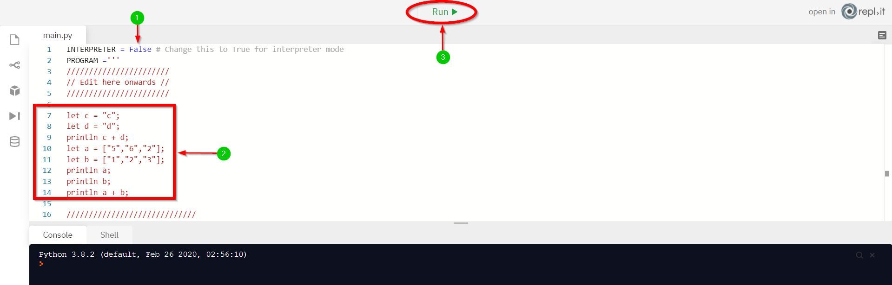
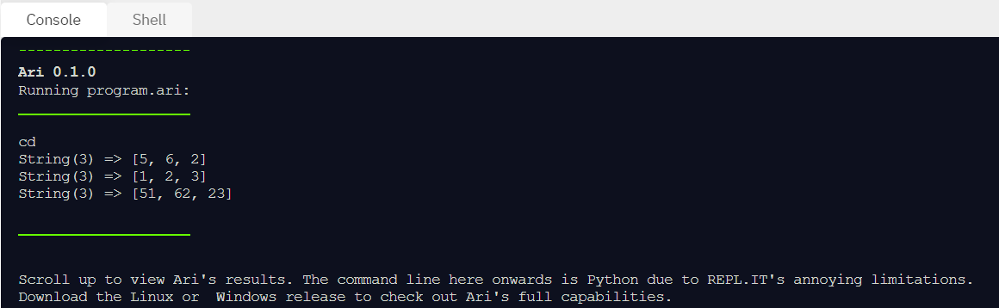

# Try It Out

***

## **Editor**
<iframe height="900em" width="100%" src="https://repl.it/@FongChien/Ari-Language-Linux?lite=true" scrolling="no" frameborder="no" allowtransparency="true" allowfullscreen="true" sandbox="allow-forms allow-pointer-lock allow-popups allow-same-origin allow-scripts allow-modals"></iframe>

***

## **Guide**
{: loading=lazy }

1. Keep the default **False** to run the Ari program. Change **False** to **True** if you want to manually key in Ari code in the command line.

2. Type an Ari program in the red box (**2**) shown above.

3. Click **Run** or the ▶ button to run the Ari program.

4. You should see an output like below:

{: loading=lazy }

* Unfortunately, you'll need to sign in to edit and run the code.
* [repl.it](http://repl.it) does not have direct support for custom language integration, so I had to configure Python to run Ari and show it on the command line.

